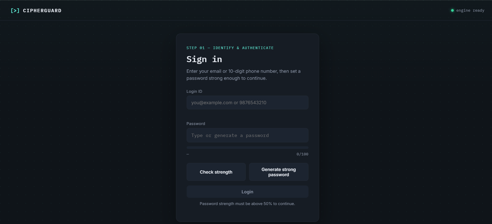
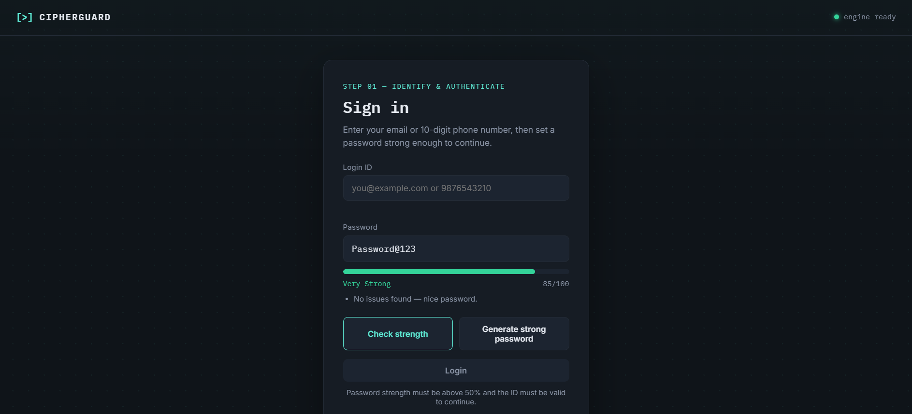
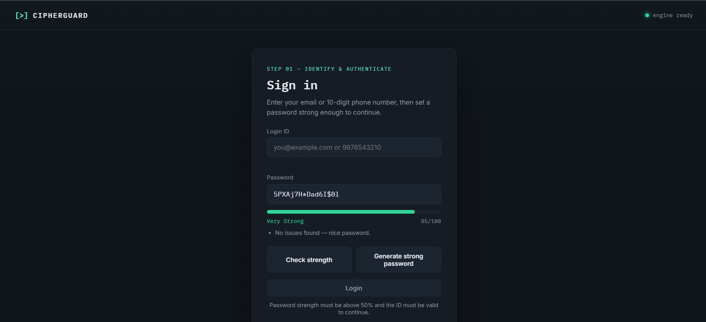
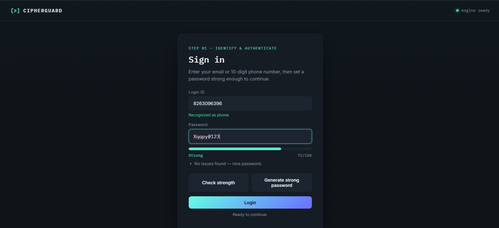
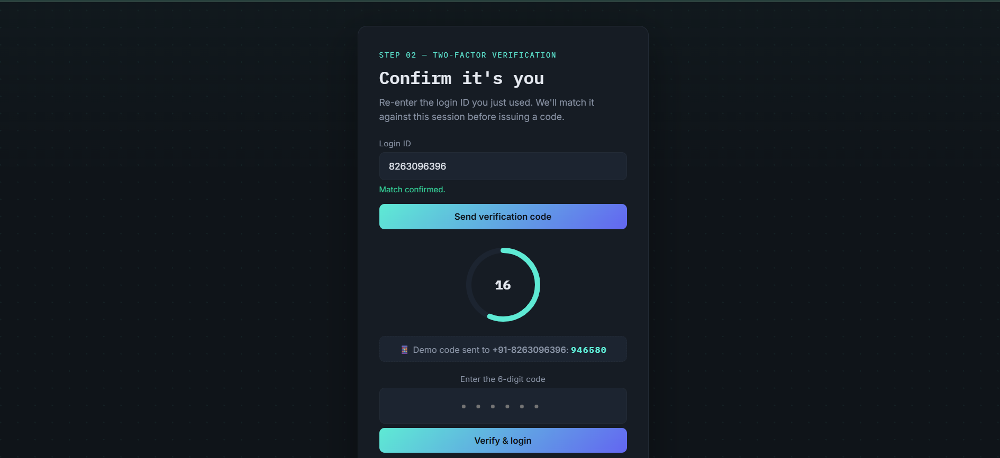
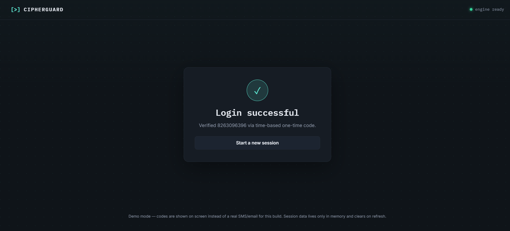

# 🔐 CipherGuard

<p align="center">


</p>

<p align="center">

### Secure Authentication Toolkit built using **C++17**, **WebAssembly (WASM)**, **HTML**, **CSS**, and **JavaScript**

A demonstration project showcasing secure authentication concepts including password strength analysis, secure password generation, and TOTP (Time-based One-Time Password) generation using a shared C++ engine compiled to WebAssembly.

</p>

---

# 📖 Project Overview

CipherGuard is a modern authentication toolkit designed to demonstrate how native C++ code can power both a Command-Line Interface (CLI) application and a browser-based web application using **WebAssembly**.

The same authentication engine is reused across both platforms, showcasing code reusability, native performance, and secure authentication workflows.

---

# ✨ Features

## 🔐 Password Strength Checker

- Password strength scoring (0–100)
- Detects uppercase letters
- Detects lowercase letters
- Detects numbers
- Detects special characters
- Detects common weak passwords
- Provides improvement suggestions

---

## 🎲 Secure Password Generator

Generate secure passwords with:

- Custom length
- Uppercase letters
- Lowercase letters
- Numbers
- Special characters

---

## 🔢 Time-based One-Time Password (TOTP)

Implements:

- SHA-1
- HMAC-SHA1
- RFC 6238 TOTP
- 30-second rotating authentication codes

---

## 🌐 Browser Version

Compiled using **Emscripten** into WebAssembly.

Features include:

- Login validation
- Password strength meter
- Password generator
- TOTP verification
- Authentication success page
- Session reset after refresh

---

# 🚀 Technologies Used

| Technology | Purpose |
|------------|---------|
| C++17 | Authentication Engine |
| STL | Data Structures |
| WebAssembly | Browser Execution |
| Emscripten | C++ → WASM Compiler |
| HTML5 | User Interface |
| CSS3 | Styling |
| JavaScript | Frontend Logic |
| Git | Version Control |
| GitHub | Repository Hosting |

---

# 📸 Application Screenshots

## 🏠 Home

<p align="center">

</p>

---

## 🔐 Password Strength Checker

<p align="center">

</p>

---

## 🎲 Password Generator

<p align="center">

</p>

---

## 🔑 Login

<p align="center">

</p>

---

## 🔢 TOTP Verification

<p align="center">

</p>

---

## ✅ Authentication Success

<p align="center">

</p>

---

# 🏗️ System Architecture

```text
                 User
                   │
                   ▼
        HTML • CSS • JavaScript
                   │
                   ▼
          WebAssembly (auth.wasm)
                   │
                   ▼
          C++ Authentication Engine
          ├── Password Checker
          ├── Password Generator
          └── TOTP Generator
                   │
                   ▼
        Authentication Result
```

---

# 📂 Project Structure

```text
cipherguard/
│
├── docs/
│   ├── index.html
│   ├── style.css
│   ├── app.js
│   ├── auth.js
│   └── auth.wasm
│
├── screenshots/
│   ├── home.png
│   ├── login.png
│   ├── password-strength.png
│   ├── password-generator.png
│   ├── totp.png
│   └── success.png
│
├── src/
│   ├── auth_core.h
│   ├── main.cpp
│   └── wasm_bindings.cpp
│
├── README.md
└── .gitignore
```

---

# ⚙️ Installation

## Clone Repository

```bash
git clone https://github.com/JayPawar-13/cipherguard.git
cd cipherguard
```

---

# 💻 Running the CLI

Compile

```bash
g++ -std=c++17 -Wall -o cipherguard src/main.cpp
```

Run

Windows

```bash
cipherguard.exe
```

Linux / macOS

```bash
./cipherguard
```

---

# 🌐 Building the WebAssembly Version

Install **Emscripten**.

Activate the SDK.

Compile using:

```bash
emcc src/main.cpp src/wasm_bindings.cpp -o docs/auth.js ^
-s WASM=1 ^
-lembind ^
-s MODULARIZE=1 ^
-s EXPORT_NAME="AuthModule"
```

Generated files:

```text
docs/
├── auth.js
└── auth.wasm
```

---

# 🚀 Deploying with GitHub Pages

The website will be available at:

```text
https://jaypawar-13.github.io/cipherguard/
```

---

# 🔮 Future Improvements

- QR Code generation for TOTP
- AES-256 file encryption
- Password history manager
- Password vault
- Dark/Light mode
- Multi-factor authentication
- Biometric authentication support
- Cloud synchronization
- Secure credential storage
- User account database integration

---

# 📚 Learning Outcomes

This project demonstrates practical knowledge of:

- Modern C++
- Object-Oriented Programming
- WebAssembly
- Emscripten
- Browser integration with native code
- Password security concepts
- TOTP authentication
- Secure software development
- Git and GitHub workflows

---

# 👨‍💻 Author

**Jay Pawar**

B.Tech Computer Science (AI/ML)

Symbiosis Institute of Technology

GitHub:

https://github.com/JayPawar-13

---

# ⭐ Support

If you found this project useful, consider giving it a ⭐ on GitHub.

It helps others discover the project and supports future development.